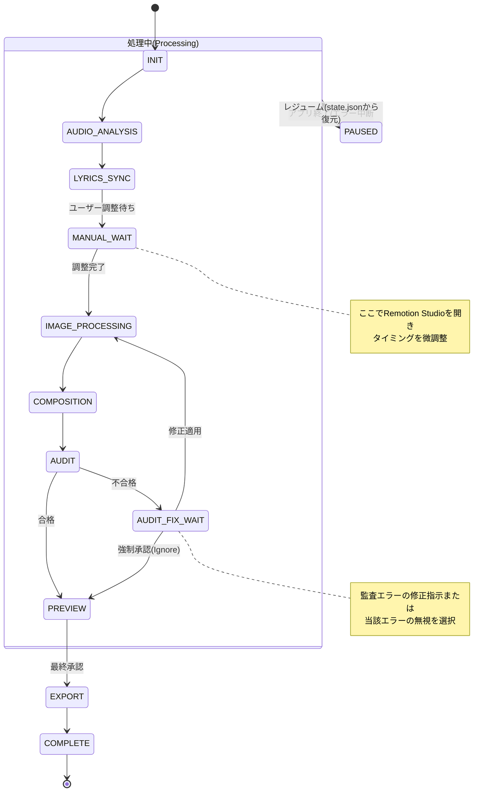
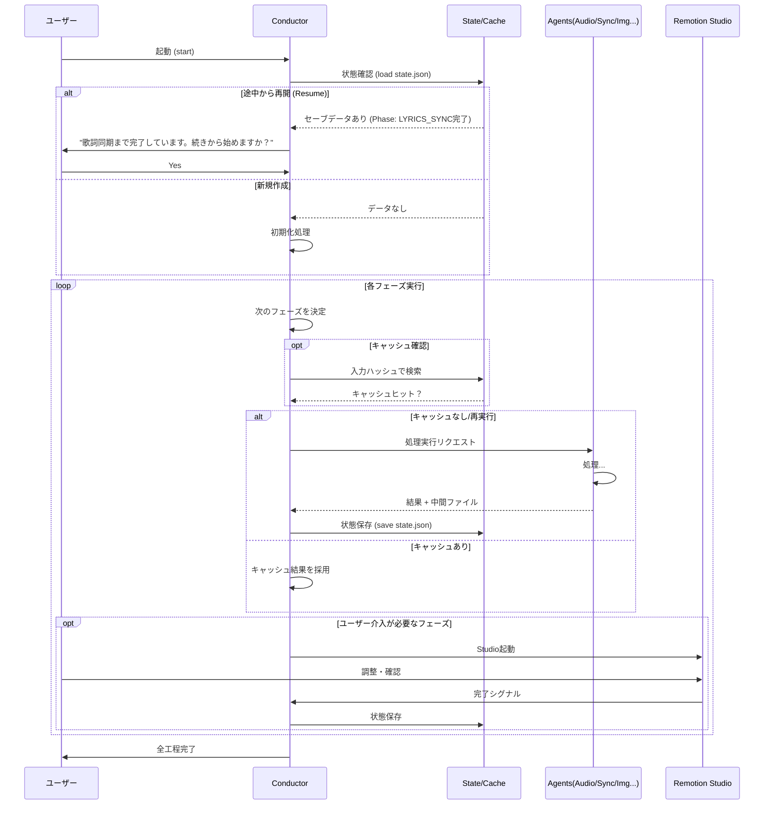

# リリックビデオ自動生成システム 要件定義書 (v1.1)

## 1. プロジェクト概要

### 1.1 目的
Remotion × Google Antigravityを使用して、リリックビデオのショート動画（30s〜50s）を半自動で生成するシステムを構築する。

### 1.2 コンセプト
- **「80%自動、20%こだわり」** のハイブリッドアプローチ
- 面倒な作業は自動化し、クリエイティブな調整だけ手動で行う
- 量産可能だが、品質も担保できるバランス
- **「Stop & Go」**: いつでも中断でき、いつでも再開できる堅牢性

### 1.3 技術スタック
| 要素 | 技術 |
|------|------|
| 開発環境 | Google Antigravity |
| 動画生成 | Remotion |
| 音声解析 | Whisper (ローカル/無料) |
| 調整UI | Remotion Studio + カスタムProps |
| 言語 | TypeScript |
| 状態管理 | JSONファイルベース（永続化） |

---

## 2. システム全体構成

### 2.1 アーキテクチャ図


```mermaid
flowchart TB
    subgraph INPUT["📥 ユーザー入力"]
        MUSIC[🎵 音楽ファイル]
        LYRICS[📝 歌詞テキスト]
        IMAGES[🖼️ 画像複数枚]
        CONFIG[⚙️ プロジェクト設定]
    end

    subgraph STORAGE["💾 永続化ストレージ"]
        STATE[state.json<br/>(進捗・状態)]
        CACHE[cache/<br/>(中間生成物)]
    end

    subgraph CONDUCTOR["🎼 Conductor Agent（指揮者）"]
        CORE[Core Logic]
        RESUME[Resume/Recovery]
    end

    subgraph AGENTS["🤖 専門エージェント群"]
        A1[① 音声解析Agent]
        A2[② 歌詞同期Agent]
        A3[③ 画像処理Agent]
        A4[④ 合成Agent]
        A5[⑤ 監査Agent]
    end

    subgraph UI["🖥️ ユーザーインターフェース"]
        STUDIO[Remotion Studio<br/>(調整・プレビュー)]
        DASHBOARD[CLI Dashboard<br/>(進捗表示)]
    end

    INPUT --> CONDUCTOR
    CONDUCTOR <--> STORAGE
    CONDUCTOR --> AGENTS
    AGENTS --> CONDUCTOR
    CONDUCTOR <--> UI
```

### 2.2 状態遷移図（ライフサイクル）



### 2.3 詳細処理フロー（キャッシュ・レジューム含む）




---

## 3. 各エージェント詳細仕様

### 3.1 Conductor Agent（指揮者）

**役割**: 全体のオーケストレーション、状態管理、レジューム機能の提供

```typescript
interface ConductorState {
  projectId: string;
  lastUpdated: string;
  currentPhase: Phase;
  history: PhaseLog[];
  // 各フェーズの成果物を保持
  data: {
    audio?: AudioAnalysisOutput;
    sync?: LyricsSyncOutput;
    images?: ImageProcessingOutput;
    composition?: CompositionOutput;
    audit?: AuditOutput;
  };
}

// 永続化インターフェース
interface StateManager {
  save: (state: ConductorState) => Promise<void>;
  load: (projectId: string) => Promise<ConductorState | null>;
  reset: (projectId: string) => Promise<void>;
}
```

#### レジューム機能要件
- 各フェーズ完了ごとに `state.json` をディスクに書き込む
- 起動時に `state.json` を検知したら「続きから始めるか？」を問う
- ユーザー介入待ち（MANUAL_ADJUSTMENT等）の状態も保存する

---

### 3.2 ① 音声解析Agent

**役割**: 音声ファイルから文字起こし＋タイムスタンプを生成
**キャッシュ戦略**: 音声ファイルのハッシュ値を使用

```typescript
interface AudioAnalysisInput {
  audioFile: string;
  language: 'ja' | 'en';
  modelSize: string;
  
  // キャッシュ制御用
  fileHash: string;     // 音声ファイルのMD5/SHA256
  forceRefresh: boolean; // キャッシュ強制破棄フラグ
}
```

---

### 3.3 ② 歌詞同期Agent

**役割**: 自動文字起こしを正解歌詞で補正

（仕様はv1.0と同様）

---

### 3.4 手動調整フェーズ（Remotion Studio）

（仕様はv1.0と同様）

---

### 3.5 ③ 画像処理Agent

**役割**: 画像にアニメーション設定を付与
**キャッシュ戦略**: 画像セットと歌詞タイミングの組み合わせで判定

```typescript
interface ImageProcessingInput {
  images: string[];
  totalDuration: number;
  segments: LyricSegment[];
  
  // 設定ハッシュ（画像パスリスト + セグメント情報のハッシュ）
  configHash: string;
}
```

---

### 3.6 ④ 合成Agent

（仕様はv1.0と同様）

---

### 3.7 ⑤ 監査Agent

**役割**: 生成動画の品質チェックと自動修正
**追加機能**: 例外承認（Ignore）リストの管理

#### 入力（Input）更新版
```typescript
interface AuditInput {
  videoPath: string;
  lyrics: LyricSegment[];
  templateOptions: TemplateOptions;
  strictMode: boolean;
  
  // 以前の結果と無視リスト
  previousAuditId?: string;
  ignoredIssueIds: string[]; // ユーザーが「これでOK」としたIssueのIDリスト
}
```

#### 出力（Output）更新版
```typescript
interface AuditOutput {
  auditId: string;
  passed: boolean;
  issues: AuditIssue[];
  ignoredIssues: AuditIssue[]; // 無視されたIssue（ログ用）
  report: AuditReportWithSuggestions;
}
```

#### 監査ロジック（Ignore対応）
1. 問題を検出する
2. 検出された各Issueについて、`input.ignoredIssueIds` に含まれているかチェック
3. 含まれていれば `ignoredIssues` に移動し、合否判定（`passed`）には影響させない
4. 残ったCriticalなIssueがあれば `passed: false` とする

---

## 4. ファイル・データ形式仕様

### 4.1 プロジェクト状態ファイル (state.json)

```json
{
  "projectId": "my-lyric-video-001",
  "lastUpdated": "2026-01-03T19:00:00Z",
  "currentPhase": "AUDIT_FIX_WAIT",
  "data": {
    "audio": {
      "srtFile": "temp/audio.srt",
      "duration": 45.5,
      "confidence": 0.98
    },
    // ...各フェーズの中間データ
  },
  "config": {
    "ignoredAuditIssues": ["issue-123", "issue-456"]
  }
}
```

---

## 5.〜9. （v1.0と同様）

基本的なディレクトリ構成、エラーハンドリング、テンプレート一覧等はv1.0を踏襲する。
ただし、`temp/` ディレクトリ内に `cache/` と `states/` ディレクトリを追加し、これらは `.gitignore` の対象とする。

```
lyric-video-generator/
├── temp/
│   ├── cache/          # 計算コストの高い処理の結果キャッシュ
│   │   ├── whisper/    # Whisper解析結果
│   │   └── images/     # リサイズ・クロップ済み画像
│   └── states/         # プロジェクトごとのstate.json
```
